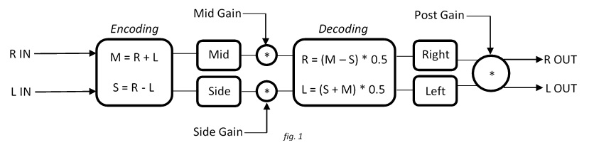
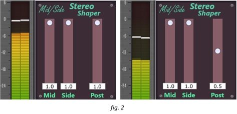
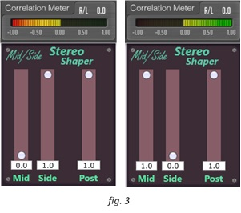

# Mid/Side Stereo Shaper

### Introduction
\
	The aim of this project was to develop a VST plugin that processes audio in real-time and that could be utilised as a mixing tool. The first part of the project consists of a C++ console application that processes a set of stereo sample values in accordance with user-defined parameter values and a processing algorithm, and the second part develops this prototype algorithm into a functioning VST3 plugin using the JUCE framework.

### Specification
\
	The plugin is a mid/side encoder that allows the user to change the perceived stereo width of an audio track by creating mid and side channels that can then have different gain values applied to them, before being converted back to left and right channels. The user can then apply post gain to the signal after this processing has taken place.  The programme receives left and right channel audio buffers as inputs, as well as three user-defined floating-point values between 0 and 1 for mid gain, side gain and post gain. The balance of the mid and side channels and the post gain level is set through a basic graphical user interface before the mid and side channels are decoded and the left and right buffers are outputted to the audio engine.  

### Program Description
\
	The prototype programme receives a fixed sequence of values in a 2-dimensional array that stand in for stereo buffer samples, with `sBuffer [0]` and `sBuffer [1]` representing the left and right channels respectively. The user is prompted to enter the 3 parameter values and these are validated using endless `while` loops that are only broken when valid input is received. Temporary values for storing the mid channel and side channel are declared and then, when the programme enters its processing loop, the left and right channels are summed to create the mid channel’s value and their difference is found to create the side channel’s value for each sample frame in the buffer. These mid and side values are multiplied by the user-entered mid gain and side gain values before being decoded using the summing shown in *figure 1* below; the multiplication by 0.5 is necessary to allow for the 6dB rise in amplitude that occurs when decoding. Finally, both channels are multiplied by the user’s post gain input value and the old and new stereo buffer values are outputted for testing purposes.

  In the VST, the processing block works in the same way as the prototype, but using left and right channel pointers to retrieve the buffer values via the `getWritePointer` method. Each time a slider is moved on the GUI Component, the `sliderValueChanged` method is called and the programme runs through a series of `if else` statements to check which slider’s position has been modified. A pointer to the processor is then used to update the parameter that corresponds to that slider, allowing the user to set each parameter value based on its slider’s position.
  
### User Testing
\
	Prototype testing was done using MS Visual Studio’s native compiler and an online compiler using 3 different sequences of stereo samples and user parameters to ensure that there were no anomalous results. Testing of the VST was done in Reaper by simply applying the plugin to an audio track and listening to the effect when the sides or mid were attenuated or removed completely. *Figure 2* below shows the post gain working as expected, with a value of 0.5 cutting the amplitude by -6db (half the perceived volume), while a correlation meter was used to demonstrate that the encoding and decoding was effective in *figure 3*. The meter reads ‘1’ (left and right completely in phase) when the mid channel alone is on, as only the sum of the left and right channels can be heard, and it reads ‘0’ (left and right fully out of phase) when the side channel alone is on, because only the difference between the left and right channels is being output.

 

**To use the plugin, copy the file: _`MidSideStereoShaper.dll`_ into your vst folder.**\
**By default this is found at: `C:\Program Files\Steinberg\VstPlugins`**\
**Open from your vst folder within your DAW of choice and enjoy!**
